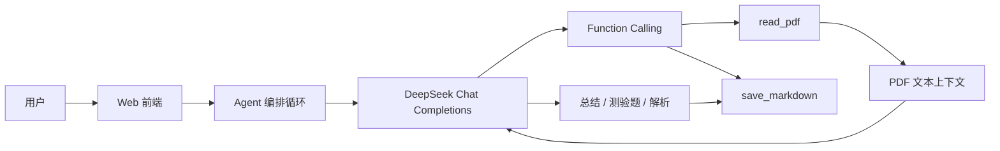

# 课程资料学习研究助手 Agent

这是一个用于 Experiment 2: Bring Your Own Agent（BYOA）的单一用途 AI Agent。它通过 OpenAI-compatible function calling 将大模型连接到本地工具，帮助学生基于课程 PDF 完成学习总结、测验题生成和 Markdown 导出。

当前默认使用 DeepSeek API，模型为 `deepseek-chat`。

## 功能

- `read_pdf`：读取本地 PDF 文件，提取文本内容，作为大模型分析的外部上下文。
- `save_markdown`：将生成的询问结果、学习总结、测验题、参考答案和解析保存为本地 Markdown 文件。
- Web 前端：顶部统一填写 API 和 PDF 设置，下方分为“询问”和“测试”两个板块。
- 询问板块：输入问题，基于 PDF 生成回答，并可导出为 Markdown。
- 测试板块：输入题目数量和测试要求，生成测验题、参考答案和解析，并可导出为 Markdown。

## 技术架构

本项目使用 OpenAI-compatible Chat Completions function calling 作为工具桥接方式。DeepSeek API 兼容 OpenAI SDK，因此后端仍使用 OpenAI Python SDK，但 `base_url` 指向 DeepSeek。



## 项目结构

- `study_agent/web_app.py`：本地 Web 前端和 HTTP API。
- `study_agent/agent.py`：Agent 主循环，负责大模型调用和工具调用编排。
- `study_agent/tools.py`：工具定义、Pydantic 参数模型和工具注册表。
- `study_agent/llm.py`：OpenAI-compatible 客户端封装。
- `study_agent/config.py`：模型、Base URL 和环境变量配置。
- `study_agent/prompts/system_prompt.md`：Agent 系统提示词。
- `scripts/run_web_ui.py`：Web UI 启动脚本。
- `REPORT.md`：实验报告草稿。

## 安装

```powershell
cd D:\codex\agent
python -m pip install --user -r requirements.txt
```

如果你想使用虚拟环境：

```powershell
python -m venv .venv
.\.venv\Scripts\Activate.ps1
pip install -r requirements.txt
```

## 启动 Web 前端

```powershell
cd D:\codex\agent
python -m study_agent.web_app --port 8899
```

打开：

```text
http://127.0.0.1:8899/
```

## 页面使用方式

### 通用设置

顶部设置对“询问”和“测试”两个板块共用：

1. 填写 `DeepSeek API Key`。
2. `API Base URL` 保持 `https://api.deepseek.com`。
3. `模型` 保持 `deepseek-chat`。
4. 填写本地 PDF 路径，例如：

```text
C:\Users\zytx\Downloads\Chap 9-Normalization(4).pdf
```

### 询问板块

1. 在“问题”里输入你想问 PDF 的内容。
2. 点击“生成询问结果”。
3. 在输出结果下填写保存目录和文件名。
4. 点击“导出询问结果”保存 Markdown。

### 测试板块

1. 输入测试题数量。
2. 输入测试要求，例如题型和覆盖范围。
3. 点击“生成测试题”。
4. 在输出结果下填写保存目录和文件名。
5. 点击“导出测试结果”保存 Markdown。

## Markdown 保存规则

- 文件名必须以 `.md` 结尾。
- 如果“保存目录”留空，只填写文件名，文件会保存到系统临时目录。
- 如果填写了保存目录，系统会严格写入该目录。
- 如果当前进程没有写入权限，会直接报错，不会偷偷改存到临时目录。
- 当前已验证可写目录：

```text
D:\codex\agent
D:\codex\agent\outputs
```

推荐保存目录：

```text
D:\codex\agent\outputs
```

## 命令行模式

列出工具：

```powershell
python -m study_agent --list-tools
```

如果使用命令行调用模型，需要配置 `.env` 或环境变量：

```text
OPENAI_API_KEY=你的 DeepSeek API Key
OPENAI_MODEL=deepseek-chat
OPENAI_BASE_URL=https://api.deepseek.com
```

## 实验截图建议

报告建议包含 3～4 张截图：

1. Web 前端页面：展示通用设置、询问板块和测试板块。
2. 询问结果：展示基于 PDF 生成的学习总结或问题回答。
3. 测试结果：展示测验题、参考答案和解析。
4. Markdown 导出：展示导出成功提示和生成的 `.md` 文件内容。

## 注意事项

- API Key 不会写入文件，但不要把真实 Key 放进截图或报告。
- PDF 必须是本机可访问路径。
- 扫描版 PDF 如果没有 OCR 文本层，`pypdf` 可能无法提取有效内容。
- 如果 DeepSeek 请求失败，优先检查 API Key、余额、代理和网络。
- 如果导出失败，优先检查保存目录权限。

