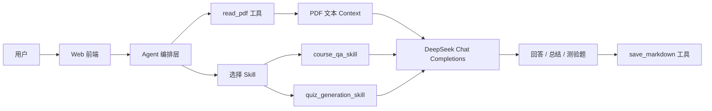

# 课程资料学习研究助手 Agent

这是一个面向课程 PDF 学习场景的单一用途 AI Agent。它内置课程学习助手系统 Prompt，并通过显式 Skill 编排和 DeepSeek 的 OpenAI-compatible Chat Completions 接口，帮助学生基于课程 PDF 完成学习总结、资料问答、测验题生成和 Markdown 导出。

当前默认使用 DeepSeek API，模型为 `deepseek-chat`。

## 功能

- `course_qa_skill`：课程资料问答 Skill，基于 PDF 上下文回答问题、总结重点、解释概念。
- `quiz_generation_skill`：复习测验生成 Skill，基于 PDF 上下文生成题目、参考答案和解析。
- `read_pdf`：底层工具，读取本地 PDF 文件，提取文本内容作为外部上下文。
- `save_markdown`：底层工具，将询问结果、学习总结、测验题、参考答案和解析保存为本地 Markdown 文件。
- Web 前端：顶部填写 DeepSeek API Key 和本地 PDF 路径，下方分为“询问”和“测试”两个板块。
- 询问板块：输入问题，基于 PDF 生成回答，并可导出为 Markdown。
- 测试板块：输入题目数量和测试要求，生成测验题、参考答案和解析，并可导出为 Markdown。

## 技术架构

本项目使用 OpenAI-compatible Chat Completions API 和本地工具注册表作为上下文桥接方式。DeepSeek API 兼容 OpenAI SDK，因此后端仍使用 OpenAI Python SDK，但 `base_url` 指向 DeepSeek。

Agent 的核心流程是：先根据任务类型选择 `course_qa_skill` 或 `quiz_generation_skill`，再调用 `read_pdf` 读取 PDF 文本作为上下文，最后将系统 Prompt、Skill Prompt 和 PDF Context 交给模型生成结果。导出时调用 `save_markdown`。



## 项目结构

- `study_agent/web_app.py`：本地 Web 前端和 HTTP API。
- `study_agent/agent.py`：Agent 编排层，负责选择 Skill、读取 PDF context、调用模型。
- `study_agent/skills.py`：两个显式 Skill：课程资料问答和复习测验生成。
- `study_agent/tools.py`：工具定义、Pydantic 参数模型和工具注册表。
- `study_agent/llm.py`：OpenAI-compatible 客户端封装。
- `study_agent/config.py`：模型、Base URL 和环境变量配置。
- `study_agent/prompts/system_prompt.md`：Agent 系统提示词。
- `study_agent/prompts/course_qa_skill.md`：课程资料问答 Skill Prompt。
- `study_agent/prompts/quiz_generation_skill.md`：复习测验生成 Skill Prompt。
- `scripts/run_web_ui.py`：基础 Web UI 启动脚本。
- `scripts/run_web_ui_hidden.py`：Windows 无窗口后台启动器。
- `scripts/restart_web_ui_hidden_task.ps1`：Windows 任务计划无窗口重启脚本。
- `scripts/stop_web_ui_task.ps1`：Windows 停止后台 Web UI 的脚本。

## 安装

克隆仓库：

```powershell
git clone https://github.com/Elaina168/course-research-agent.git
cd course-research-agent
```

推荐使用虚拟环境安装依赖：

```powershell
python -m venv .venv
.\.venv\Scripts\Activate.ps1
pip install -r requirements.txt
```

macOS / Linux：

```bash
python3 -m venv .venv
source .venv/bin/activate
pip install -r requirements.txt
```

## 启动 Web 前端

通用启动方式：

```powershell
python -m study_agent.web_app --port 8899
```

打开：

```text
http://localhost:8899/
```

Windows 如果希望后台无窗口运行，可以使用：

```powershell
powershell -ExecutionPolicy Bypass -File .\scripts\restart_web_ui_hidden_task.ps1
```

停止 Windows 后台服务：

```powershell
powershell -ExecutionPolicy Bypass -File .\scripts\stop_web_ui_task.ps1
```

## 页面使用方式

### 通用设置

顶部设置对“询问”和“测试”两个板块共用：

1. 填写 `DeepSeek API Key`。
2. 填写你自己电脑上的本地 PDF 路径。
3. 系统默认使用 `https://api.deepseek.com` 和 `deepseek-chat`，页面不需要手动填写 Base URL 和模型。

Windows PDF 路径示例：

```text
C:\Users\你的用户名\Downloads\course-reading.pdf
```

macOS / Linux 路径示例：

```text
/Users/your-name/Downloads/course-reading.pdf
```

### 询问板块

1. 在“问题”里输入你想问 PDF 的内容。
2. 点击“生成询问结果”。
3. 在输出结果下填写保存目录和文件名。
4. 点击“导出询问结果”保存 Markdown。

### 测试板块

1. 输入测试题数量。
2. 输入测试要求，例如题型和覆盖范围。
3. 点击“生成测试题”。
4. 在输出结果下填写保存目录和文件名。
5. 点击“导出测试结果”保存 Markdown。

## Markdown 保存规则

- 文件名必须以 `.md` 结尾。
- 如果“保存目录”留空，只填写文件名，文件会保存到系统临时目录。
- 如果填写了保存目录，系统会严格写入该目录。
- 如果当前进程没有写入权限，会直接报错，不会偷偷改存到临时目录。

Windows 保存目录示例：

```text
C:\Users\你的用户名\Documents\course-agent-outputs
```

macOS / Linux 保存目录示例：

```text
/Users/your-name/course-agent-outputs
```

如果保存失败，请确认该目录存在，且当前用户有写入权限。

## 命令行模式

列出工具：

```powershell
python -m study_agent --list-tools
```

如果使用命令行调用模型，需要配置 `.env` 或环境变量：

```text
OPENAI_API_KEY=你的 DeepSeek API Key
OPENAI_MODEL=deepseek-chat
OPENAI_BASE_URL=https://api.deepseek.com
```

Web 前端不要求创建 `.env`，因为 API Key 会在页面中填写。

## 注意事项

- API Key 不会写入文件，但不要把真实 Key 放进截图或公开材料。
- PDF 必须是使用者本机可访问路径，不能直接使用别人电脑上的路径。
- 扫描版 PDF 如果没有 OCR 文本层，`pypdf` 可能无法提取有效内容。
- 如果 DeepSeek 请求失败，优先检查 API Key、余额、代理和网络。
- 如果导出失败，优先检查保存目录权限。
